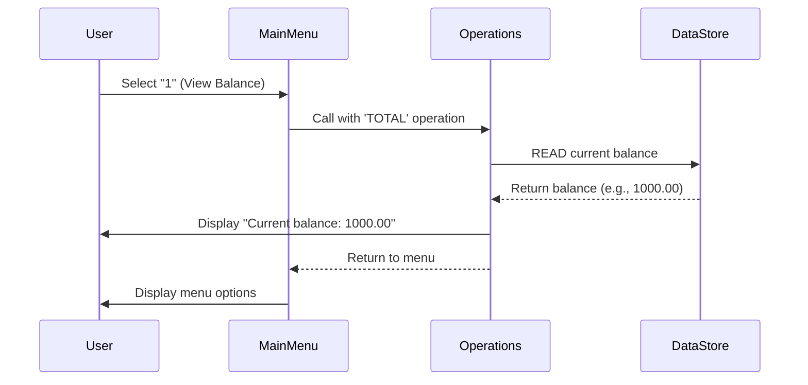
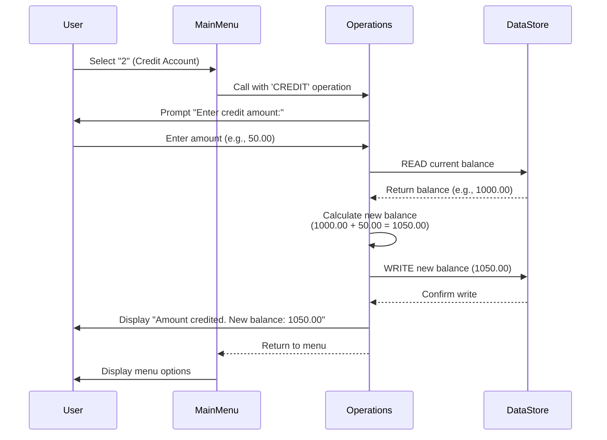
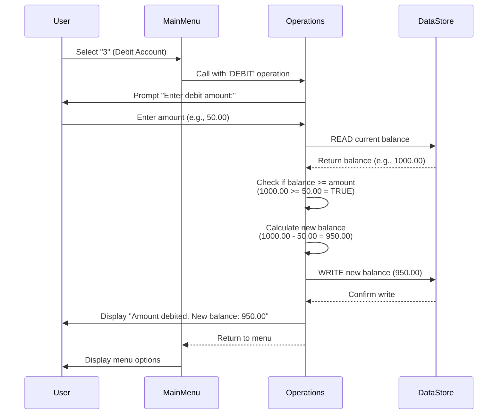
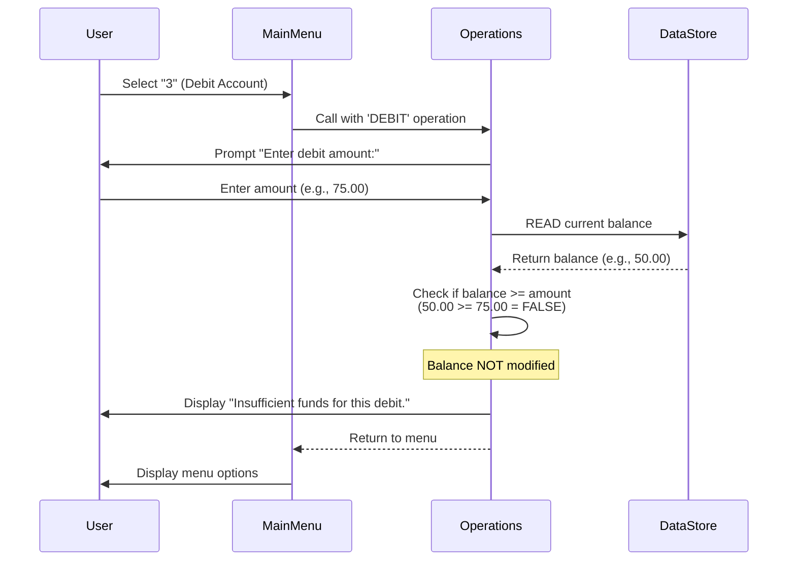
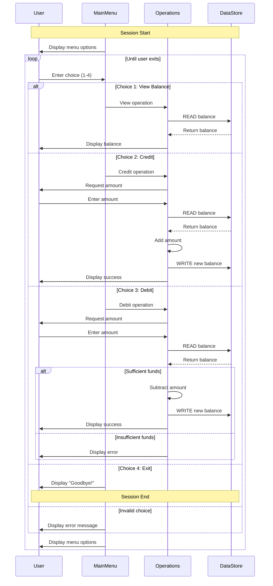

# School Account Management System Specification

## System Overview

### Purpose
The School Account Management System is a financial management tool that allows school staff to manage student account balances. The system tracks individual student account balances and allows authorized users to view balances, add credits (such as deposits or payments received), and deduct charges (such as fees or purchases).

### Target Users
- School office staff
- School administrators
- Cafeteria managers
- Any authorized personnel who manage student financial accounts

### Key Capabilities
- View current student account balance
- Credit accounts (add money)
- Debit accounts (deduct money)
- Prevent overdrafts through built-in validation

---

## Data Structures

### Student Account Balance

**Data Element:** Account Balance

**Type:** Monetary amount (dollars and cents)

**Format:** Up to 6 digits before the decimal point, 2 digits after (e.g., 123456.78)

**Default Value:** $1,000.00

**Valid Range:** 
- Minimum: $0.00
- Maximum: $999,999.99

**Constraints:**
- Balance must always be a non-negative number
- Balance cannot exceed $999,999.99
- Precision is limited to cents (2 decimal places)

**Business Context:** This represents the current monetary balance in a student's account. A positive balance means the student has funds available. A zero balance means no funds are available.

---

## Business Rules

### Rule 1: Initial Account Balance
**Requirement:** Each student account SHALL begin with a default balance of $1,000.00.

**Rationale:** Provides students with an initial allocation for school expenses.

**Implementation Note:** This default is applied when a new account is created or when the system is initialized.

---

### Rule 2: Insufficient Funds Prevention
**Requirement:** The system SHALL NOT allow a debit transaction that would result in a negative account balance.

**Rationale:** Prevents students from going into debt and ensures the school does not provide services beyond available funds.

**Acceptance Criteria:**
- GIVEN a student account with balance of $50.00
- WHEN a debit of $75.00 is attempted
- THEN the transaction SHALL be rejected
- AND the balance SHALL remain $50.00
- AND the user SHALL see an error message: "Insufficient funds for this debit"

**Edge Cases:**
- **Zero balance:** A debit of any amount on a $0.00 balance SHALL be rejected
- **Exact balance debit:** A debit equal to the current balance SHALL be allowed (e.g., $50.00 debit on $50.00 balance results in $0.00)
- **Just over balance:** A debit of $50.01 on a $50.00 balance SHALL be rejected

---

### Rule 3: Unlimited Credit Acceptance
**Requirement:** The system SHALL allow credit transactions of any amount, subject only to the maximum balance constraint.

**Rationale:** There is no practical need to limit how much money can be added to a student account, as long as the system can store the value.

**Acceptance Criteria:**
- GIVEN a student account with any balance
- WHEN a credit transaction is entered
- THEN the credit SHALL be accepted
- AND the new balance SHALL be calculated as: current balance + credit amount
- UNLESS the resulting balance would exceed $999,999.99

**Edge Cases:**
- **Credit exceeding maximum:** If current balance is $999,990.00 and credit is $20.00, the transaction should be evaluated based on system capacity (may require clarification on whether to accept, reject, or cap at maximum)

---

### Rule 4: Balance Calculation Accuracy
**Requirement:** All balance calculations SHALL maintain accuracy to two decimal places (cents).

**Rationale:** Financial accuracy is essential; all monetary amounts must be precise to the cent.

**Acceptance Criteria:**
- GIVEN any transaction amount with cents
- WHEN balance is calculated
- THEN the result SHALL be accurate to 2 decimal places
- AND no rounding errors SHALL accumulate over multiple transactions

---

### Requirement: Maximum Credit Limit
The system SHALL reject credit operations that would result in a balance exceeding $999,999.99.

## Operations

### Operation 1: View Balance

**Purpose:** Display the current balance of a student account to the user.

**User Intent:** "I want to check how much money is in the student's account."

**Required Inputs:** None (system operates on a single account context)

**System Processing:**
1. The system retrieves the current balance from storage
2. The system formats the balance for display

**Expected Output:** 
- A message displaying: "Current balance: [amount]"
- Example: "Current balance: 1000.00"

**Success Criteria:**
- The displayed balance matches the actual stored balance
- The amount is shown in standard monetary format with 2 decimal places

**Error Conditions:** None (this operation cannot fail under normal circumstances)

**Performance:** Response should be immediate (sub-second)

---

### Operation 2: Credit Account

**Purpose:** Add money to a student account (deposits, payments, refunds, or allocations).

**User Intent:** "I want to add money to the student's account."

**Required Inputs:**
- Credit amount (monetary value to be added)

**Input Validation:**
- Amount must be a positive number
- Amount must have at most 2 decimal places
- Amount must not cause balance to exceed $999,999.99

**System Processing:**
1. The system prompts: "Enter credit amount:"
2. The user enters the amount to credit
3. The system retrieves the current balance
4. The system calculates the new balance: current balance + credit amount
5. The system stores the new balance
6. The system displays the result to the user

**Expected Output:**
- A message displaying: "Amount credited. New balance: [new amount]"
- Example: If balance was $1000.00 and credit was $50.00, display: "Amount credited. New balance: 1050.00"

**Success Criteria:**
- The new balance equals the old balance plus the credit amount
- The transaction is permanent (stored for future operations)
- The user receives confirmation of the new balance

**Error Conditions:**
- **Invalid input format:** If user enters non-numeric value or more than 2 decimal places (implementation-specific handling required)
- **Negative amount:** If user enters a negative number (implementation-specific handling required)
- **Exceeds maximum balance:** If credit would cause balance to exceed $999,999.99 (implementation-specific handling required)

**Example Scenarios:**
- Balance $1000.00 + Credit $250.00 = New Balance $1250.00
- Balance $500.50 + Credit $100.25 = New Balance $600.75
- Balance $0.00 + Credit $1000.00 = New Balance $1000.00

---

### Operation 3: Debit Account

**Purpose:** Subtract money from a student account (to pay for fees, meals, supplies, or other charges).

**User Intent:** "I want to charge the student's account for a purchase or fee."

**Required Inputs:**
- Debit amount (monetary value to be deducted)

**Input Validation:**
- Amount must be a positive number
- Amount must have at most 2 decimal places
- Amount must not exceed the current balance (enforced by Business Rule 2)

**System Processing:**
1. The system prompts: "Enter debit amount:"
2. The user enters the amount to debit
3. The system retrieves the current balance
4. The system checks if the balance is sufficient (balance >= debit amount)
5. **If sufficient funds:**
   - The system calculates the new balance: current balance - debit amount
   - The system stores the new balance
   - The system displays success message
6. **If insufficient funds:**
   - The system does NOT modify the balance
   - The system displays an error message

**Expected Output (Success):**
- A message displaying: "Amount debited. New balance: [new amount]"
- Example: If balance was $1000.00 and debit was $50.00, display: "Amount debited. New balance: 950.00"

**Expected Output (Insufficient Funds):**
- A message displaying: "Insufficient funds for this debit."
- The balance remains unchanged

**Success Criteria:**
- When funds are sufficient: the new balance equals the old balance minus the debit amount
- When funds are insufficient: the balance remains unchanged and an error message is shown
- The transaction result is permanent
- The user receives clear feedback on the outcome

**Error Conditions:**
- **Insufficient funds:** Debit amount exceeds current balance
  - GIVEN balance $50.00
  - WHEN debit $75.00 is attempted
  - THEN balance remains $50.00
  - AND user sees "Insufficient funds for this debit"
- **Invalid input format:** User enters non-numeric value (implementation-specific handling required)
- **Negative amount:** User enters negative number (implementation-specific handling required)

**Example Scenarios:**
- **Sufficient funds:** Balance $1000.00 - Debit $250.00 = New Balance $750.00
- **Exact balance debit:** Balance $500.00 - Debit $500.00 = New Balance $0.00
- **Insufficient funds:** Balance $50.00 - Debit $75.00 = Balance remains $50.00 (rejected)
- **Zero balance debit:** Balance $0.00 - Debit $10.00 = Balance remains $0.00 (rejected)
- **Decimal accuracy:** Balance $100.00 - Debit $25.50 = New Balance $74.50

---

## User Interface Flow

### Main Menu

**Display Format:**
```
--------------------------------
Account Management System
1. View Balance
2. Credit Account
3. Debit Account
4. Exit
--------------------------------
Enter your choice (1-4):
```

**User Interaction:**
1. The system displays the menu
2. The system prompts the user to enter a choice (1-4)
3. The user enters a number
4. The system processes the choice

**Menu Navigation Rules:**
- After any operation (View, Credit, or Debit) completes, the system returns to the main menu
- The menu is displayed repeatedly until the user chooses to exit
- The system only exits when the user explicitly chooses option 4

---

### Interaction Flow for Each Option

#### Option 1: View Balance
**Flow:**
1. User selects "1" from main menu
2. System displays: "Current balance: [amount]"
3. System returns to main menu

**User Experience:** Quick information lookup, no further input required

---

#### Option 2: Credit Account
**Flow:**
1. User selects "2" from main menu
2. System displays: "Enter credit amount:"
3. User enters amount (e.g., "50.00")
4. System displays: "Amount credited. New balance: [new amount]"
5. System returns to main menu

**User Experience:** Simple two-step process: select operation, enter amount

---

#### Option 3: Debit Account
**Flow:**
1. User selects "3" from main menu
2. System displays: "Enter debit amount:"
3. User enters amount (e.g., "25.00")
4. System performs validation check:
   - **If sufficient funds:** System displays "Amount debited. New balance: [new amount]"
   - **If insufficient funds:** System displays "Insufficient funds for this debit"
5. System returns to main menu

**User Experience:** Simple two-step process with clear feedback on success or failure

---

#### Option 4: Exit
**Flow:**
1. User selects "4" from main menu
2. System displays: "Exiting the program. Goodbye!"
3. System terminates

**User Experience:** Clean exit with confirmation message

---

#### Invalid Option Handling
**Flow:**
1. User enters any value other than 1, 2, 3, or 4
2. System displays: "Invalid choice, please select 1-4."
3. System returns to main menu (remains in the menu loop)

**User Experience:** Forgiving error handling that guides user back to valid options

---

## Implementation Requirements

### Data Persistence
**Requirement:** The system SHALL maintain the account balance across multiple operations within a session.

**Current Implementation Note:** The COBOL implementation uses in-memory storage with a DataProgram module that maintains state through READ and WRITE operations.

**Future Implementation Consideration:** A production system would require persistent storage (database or file system) to maintain balances across system restarts.

---

### Session Management
**Requirement:** The system SHALL maintain a continuous session until the user explicitly chooses to exit.

**Behavior:**
- The system continuously loops through the menu display and operation execution
- Operations do not automatically terminate the program
- Only explicit user selection of "Exit" terminates the session

---

### Display Formatting
**Requirement:** All monetary amounts SHALL be displayed in a consistent format.

**Format Specification:**
- Display amounts with exactly 2 decimal places
- No currency symbol is explicitly shown (e.g., "1000.00" not "$1000.00")
- Large amounts use standard numeric notation without separators (e.g., "123456.78" not "123,456.78")

**Rationale:** Consistency in display format reduces user confusion and potential data entry errors.

---

## Known Limitations and Areas for Clarification

### Multiple Account Support
**Current State:** The system manages a single account balance.

**Question for Domain Experts:** Should the system support:
- Multiple student accounts with unique identifiers?
- Account selection before operations?
- Account lookup by student ID or name?

---

### Maximum Balance Handling
**Current State:** The system can store balances up to $999,999.99 based on data type.

**Question for Domain Experts:** 
- Should credits that would exceed this limit be rejected?
- Should they be capped at the maximum?
- Is this limit realistic for the school's use case?

---

### Transaction History
**Current State:** The system does not maintain a transaction log or history.

**Question for Domain Experts:**
- Should the system track who performed each transaction?
- Should there be a transaction history report?
- What audit requirements exist for financial transactions?

---

### Input Validation Details
**Current State:** Detailed validation for non-numeric input or negative amounts is not explicitly defined in the COBOL code.

**Question for Domain Experts:**
- How should the system handle invalid input formats?
- Should negative amounts be rejected with a specific error message?
- Should there be a minimum transaction amount?

---

### Authentication and Authorization
**Current State:** The system has no user authentication or role-based access control.

**Question for Domain Experts:**
- Who should be authorized to perform each operation?
- Should there be different permission levels (e.g., view-only vs. transaction authority)?
- Should the system log which user performed each action?

---

### Currency and Localization
**Current State:** Amounts are displayed without currency symbols.

**Question for Domain Experts:**
- Is this system used in a single-currency environment?
- Should currency symbols be displayed?
- Are there any localization requirements for different regions?

---

## Acceptance Criteria Summary

The system SHALL be considered complete when:

1. **View Balance Operation:**
   - Displays current balance accurately to 2 decimal places
   - Returns to menu after display

2. **Credit Account Operation:**
   - Accepts positive monetary amounts
   - Correctly adds amount to current balance
   - Displays new balance after credit
   - Returns to menu after completion

3. **Debit Account Operation:**
   - Accepts positive monetary amounts
   - Validates sufficient funds before processing
   - Rejects transactions that would result in negative balance
   - Correctly subtracts amount from balance when sufficient funds exist
   - Displays appropriate success or error message
   - Returns to menu after completion

4. **Menu Navigation:**
   - Displays all menu options clearly
   - Accepts numeric choices 1-4
   - Handles invalid choices gracefully
   - Continues to loop until user explicitly exits
   - Displays farewell message on exit

5. **Data Accuracy:**
   - All calculations maintain 2 decimal place precision
   - Balance persists correctly across operations within a session
   - No rounding errors accumulate

---

## References

### Source Code
- Legacy COBOL implementation: `src/cobol/`
  - `main.cob` - Menu interface and program flow
  - `operations.cob` - Business logic for credit, debit, and balance operations
  - `data.cob` - Data storage and retrieval operations

### Related Documents
- Test Plan: `docs/TESTPLAN.md` (to be created based on this specification)

---

## System Diagrams

### Sequence Diagrams

The following sequence diagrams illustrate the data flow and interactions between system components for each operation.

#### View Balance Operation



#### Credit Account Operation



#### Debit Account Operation (Sufficient Funds)



#### Debit Account Operation (Insufficient Funds)



#### Complete User Session Flow



---

## Document History

**Version 1.0** - Initial specification extracted from legacy COBOL system
- Documented current system behavior and business rules
- Identified areas requiring domain expert clarification
- Established baseline for modern system implementation
